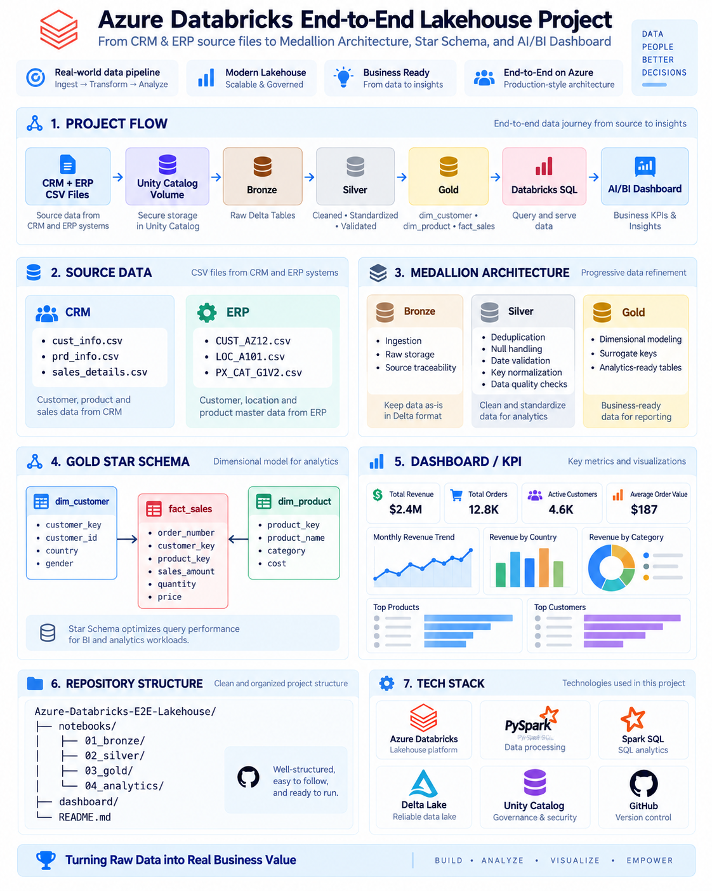

# Azure Databricks End-to-End Lakehouse

End-to-end data engineering project built with **Azure Databricks, PySpark, Delta Lake, Unity Catalog, and Databricks SQL**.

The project ingests CRM and ERP source data, applies a **Medallion Architecture (Bronze / Silver / Gold)**, builds a **star schema**, and delivers business insights through a Databricks **AI/BI Dashboard**.

## Architecture

  

## Data Layers

### Bronze
Raw ingestion of CRM and ERP source files into Delta tables.

### Silver
Data cleaning and standardization:
- Deduplication
- Null handling
- Date parsing and validation
- Category standardization
- Customer and product key normalization
- Data quality and referential checks

### Gold
Business-ready star schema:

`dim_customer` → `fact_sales` ← `dim_product`

## Dashboard KPIs

- Total Revenue
- Total Orders
- Active Customers
- Average Order Value
- Monthly Revenue Trend
- Revenue by Country
- Revenue by Category
- Top Products
- Top Customers

## Tech Stack

- Microsoft Azure
- Azure Databricks
- Apache Spark / PySpark
- Spark SQL
- Delta Lake
- Unity Catalog
- Databricks AI/BI
- Git & GitHub

## Key Concepts

`Medallion Architecture` • `ETL/ELT` • `PySpark` • `Delta Lake` • `Data Quality` • `CRM/ERP Integration` • `Star Schema` • `Surrogate Keys` • `SQL Analytics`

## Author

**Aya Sdour**  
AI & Data Engineering Student
